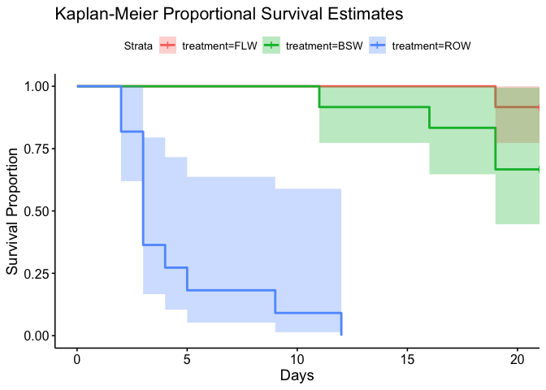
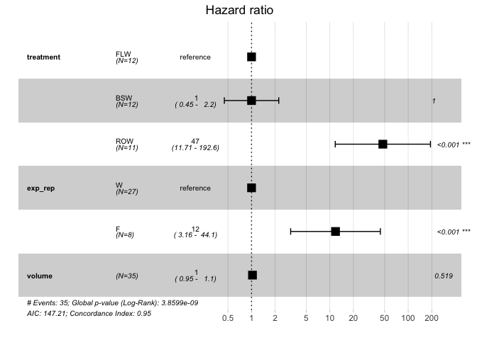
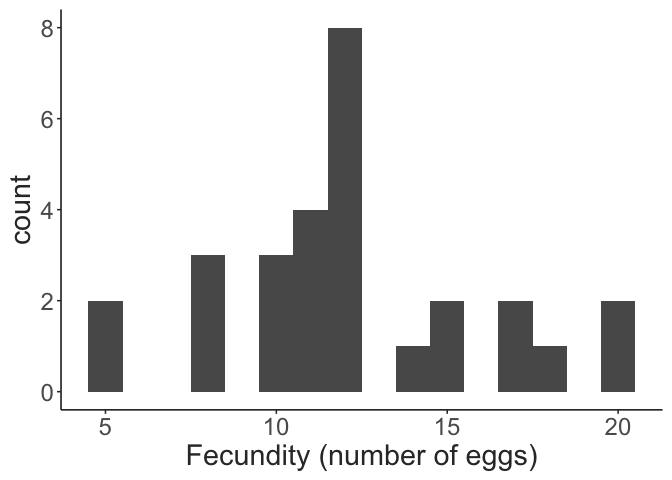
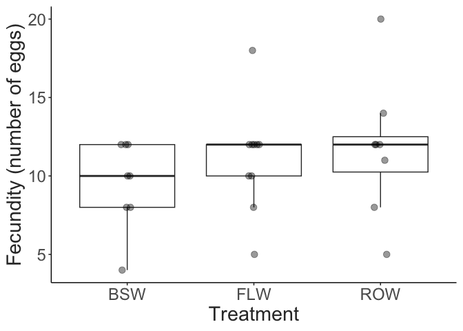
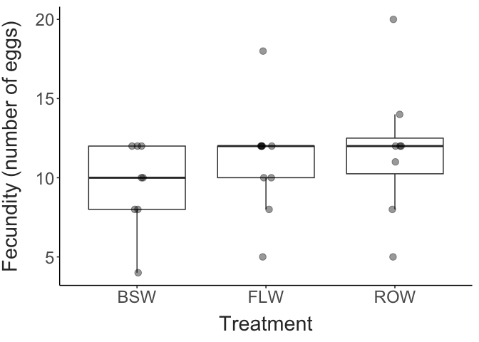

Effect of different water types of freshwater copepod survival
================
Current as of 2023-05-07

- <a href="#survival" id="toc-survival">Survival</a>
- <a href="#fecundity" id="toc-fecundity">Fecundity</a>

Copepods were collected from Lake Champlain on April 26th 2023. Water
temperature was \~7˚C. Several species were abundant, but we only
examined survival of adult female *Leptodiaptomus sicilis* here. We
expect results will be broadly generalizable to other species

# Survival

We examined survival in three different water types: 63-um filtered lake
water, bottled spring water (Crystal Geyser brand), and reverse-osmosis
filtered water. Survival was tracked for 35 individual copepods. Shown
below is the change in survival over time. Lines for the different
treatments are shown in different colors. Data for the two groups is
lumped together.

``` r
mort_data = mort_data %>%  
  mutate("status" = if_else(death_day <= 14, 1, 0),
         treatment = factor(treatment, levels = c("FLW","BSW","ROW")),
         exp_rep = factor(exp_rep, levels = c("W","F"))
  )

surv_model = survfit(Surv(death_day, status) ~ treatment, data = mort_data)

#summary(surv_model, times = c(1:14))

ggsurvplot(
  fit = surv_model,
  xlab = "Days",
  ylab = "Survival Proportion",
  title = "Kaplan-Meier Proportional Survival Estimates",
  conf.int = TRUE,
  pval = FALSE)
```



Shown below are estimates of the proportional hazard ratio (the change
in risk of mortality relative to the control) for the different
treatments, but also for the two experimental replicates.

``` r

cox_model <- coxph(Surv(death_day, status) ~ treatment + exp_rep + volume, data = mort_data)

#summary(cox_model)

ggforest(cox_model, data = mort_data)
```



# Fecundity

*Leptodiaptomus* retains eggs in loosely attached ovisacs, which allows
us to measure fecundity. Here we refer to fecundity as the number of
eggs contained in the clutch.

The initial clutch size (reflecting fecundity in the field) varied
between 4 and 20 eggs.

``` r
clutch_data %>% 
  filter(clutch_num == 1) %>%  
  ggplot(aes(x = clutch_size)) +
  geom_histogram(binwidth = 2, fill = "grey90", colour = "grey20") + 
  labs(x = "Fecundity (number of eggs)") + 
  theme_matt()
```



``` r
if(length(unique(clutch_data$clutch_num)) > 1){
  ggplot(clutch_data, aes(x = clutch_num, y = clutch_size, group = ID, colour = treatment)) + 
    geom_point(size = 2) + 
    geom_line(linewidth = 2) + 
    scale_x_continuous(breaks = seq(from = 1, to = max(clutch_data$clutch_num))) + 
    labs(x = "Clutch Number", 
         y = "Fecundity (number of eggs)") + 
    theme_matt()
}else{
  ggplot(clutch_data, aes(x = treatment, y = clutch_size)) + 
    geom_boxplot(outlier.colour = NA) + 
    geom_point(size = 3, alpha = 0.4, position = position_jitter(width = 0.05, height = 0)) + 
    labs(x = "Treatment", 
         y = "Fecundity (number of eggs)") + 
    theme_matt()
}
```



Eggs took between 1 and 8 days to hatch.

``` r
ggplot(clutch_data, aes(x = treatment, y = clutch_hold_time)) + 
  geom_boxplot() + 
  geom_point(size = 3, alpha = 0.4, position = position_jitter(width = 0.05, height = 0)) + 
  ylim(c(0, max(clutch_data$clutch_hold_time, na.rm = T))) + 
  labs(x = "Water Treatment", 
       y = "Clutch Hold Time (days)") + 
  theme_matt()
```



``` r
# There was about `r round(mean(clutch_data$pre_clutch_time, na.rm = T))` days between clutches. 

# ggplot(clutch_data, aes(x = treatment, y = pre_clutch_time)) + 
#   facet_grid(clutch_num~.) + 
#   geom_boxplot() + 
#   labs(x = "Water Treatment", 
#        y = "Time Between Clutches (days)") + 
#   theme_matt()
```
